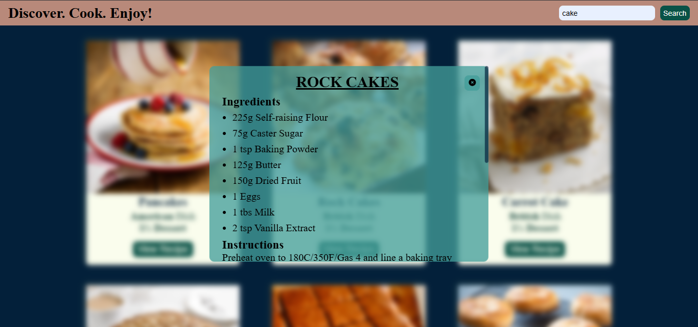

# 🍽️ Recipe Finder Website

A simple and responsive **Recipe Finder** web app built using **HTML**, **CSS**, and **JavaScript**. It allows users to search for recipes and view detailed instructions fetched from a public API.

## 📸 Screenshots

## 🛠️ Tech Stack

- **HTML5**
- **CSS3**
- **JavaScript (Vanilla JS)**
- **[TheMealDB API](https://www.themealdb.com/api.php)**

## ✨ Features

- 🔍 Search recipes by name
- 📋 View ingredients and instructions in a popup
- 🧩 Fetch data dynamically using `fetch()`
- 💡 Simple, clean UI and responsive layout

